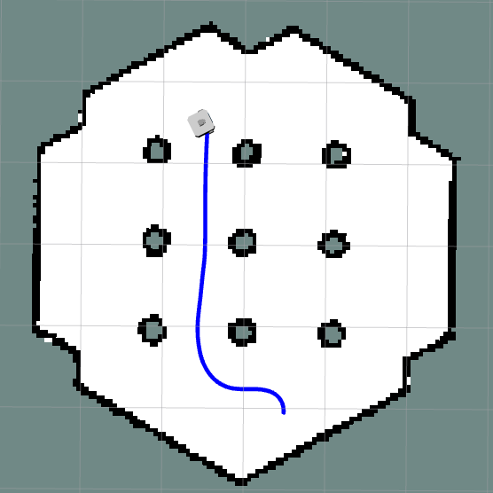

# Trajectory Visualization and Storage for AMR Navigation



## Problem Statement

In a manufacturing facility, an AMR moves materials between production stations. It uses ROS for navigation, mapping, and path planning. As it moves along predefined paths, tracking its trajectory is vital for monitoring and analysis. Manual handling of trajectory data for each navigation session is cumbersome and error-prone. Additionally, setting up RViz manually for each navigation session is inefficient, especially in a busy production environment. This problem seeks ROS nodes to automate trajectory visualization in RViz and facilitate easy storage in various file formats.

## Overview

This ROS package enables the visualization and storage of Autonomous Mobile Robot (AMR) trajectories. It consists of two main nodes: the `Trajectory Publisher and Saver Node` and the `Trajectory Reader and Publisher Node`. These nodes are designed to automate the process of visualizing the robot's path in RViz and storing the trajectory data for future analysis.

## Functions

1) **Trajectory Publisher and Saver Node:**

- Collects the robot's path as it moves.
- Publishes the trajectory data as a marker array for RViz visualization.
- Provides a ROS service to save the trajectory data to a file in formats like JSON, CSV(TODO), or YAML(TODO).
- Users can specify a time duration for saving only the trajectory data within that period.

2) **Trajectory Reader and Publisher Node:**
- Reads the saved trajectory file.
- Transforms the trajectory data to the odom frame.
- Publishes the transformed trajectory data for visualization.

## Installation

1) Clone the repository into your ROS workspace:

```
mkdir -p workspace/src
cd workspace
git clone  https://github.com/manojm-dev/Trajectory-Tools.git src/trajectory_tools
```


2) Build the package:

```
colcon build 
```

3) Source the workspace:

```
source install/setup.bash
```

## Usage

### 1. Launching the turtlebot simulation

This will start the gazebo simulation environment with turtlebot3 and rviz2.

**Start the Simulation**
```
ros2 launch trajectory_tools turtlebot.launch.py
```

### 2. Running the Trajectory Publisher and Saver Node

This node listens to the odometry topic, tracks the robot’s trajectory, and publishes it as a MarkerArray for visualization in RViz. It also provides a service to save trajectory data.

**i) Edit the config file**

This [trajectory_publisher_saver.yaml](`config/trajectory_publisher_saver.yaml`) file configures the trajectory_publisher_saver node.

**Change this as per your wish**

> [!WARNING]
>`odom_topic` in this config should not be changed in this example as turtlebot3 uses `/odom` topic only. <br>
> if you change the `marker_topic` please don't forget to change it in the rviz2.

```
trajectory_publisher_saver:
  ros__parameters:
    odom_topic: "/odom"
    marker_topic: "/trajectory_marker"
    trajectory_folder_path: "/tmp/"
```

**ii) Start the Node**

To starts the `trajectory_publisher_saver` node with the parameters from the YAML file we use a launch file here.

> [!NOTE]
> If you open another terminal please do source the workspace before proceeding to execute the cmd.


```
ros2 launch trajectory_tools trajectory_publisher_saver.launch.py
```

**iii) Move the robot**

To visulize the marker we need to move the robot. To move the robot first we should switch to rviz window to localize the robot using the `2D Pose Estimate` arrow and give can able to command the robot to any particular position using `Nav2 Goal` arrow.

**iv) Call the Service**

To save the last 10 seconds of trajectory data to a file named `test.json` inside `/tmp` directory(default param)run this in another terminal:

> [!NOTE]
> If you open another terminal please do source the workspace before proceeding to run it in the terminal

```
ros2 service call /save_trajectory trajectory_tools/srv/SaveTrajectory "{filename: 'test', duration: 10.0}"
```

<video controls src="media/trajectory_publisher_saver.mp4" title="trajectory_publisher_saver"></video>

### 3. Running the Trajectory Reader and Publisher Node

This node reads a saved trajectory file, applies necessary transformations, and republishes it for visualization in RViz.

**i) Edit the config file**

This yaml config file plays trajectory file `test.json` inside `/tmp` directory(default save location)

> [!WARNING]
>`odom_topic` in this config should not be changed in this example as turtlebot3 uses `/odom` topic only. <br>
> if you change the `marker_topic` please don't forget to change it in the rviz2.

```
trajectory_reader_publisher:
  ros__parameters:
    odom_topic: "/odom"
    marker_topic: "/trajectory_marker"
    trajectory_folder_path: "/tmp/"
    trajectory_file_name: "test"
```

**ii) Start the Node**

To starts the `trajectory_reader_publisher` node with the parameters from the YAML file we use a launch file here.

> [!NOTE]
> If you open another terminal please do source the workspace before proceeding to run it in the terminal

```
ros2 launch trajectory_tools trajectory_reader_publisher.launch.py
```

**iii) Viewing the data**

In order to view the visualized the trajectory data in `MarkerArrays` we have to switch to the rviz2 window.

<video controls src="media/trajectory_reader_publisher.mp4" title="trajectory_reader_publisher"></video>
