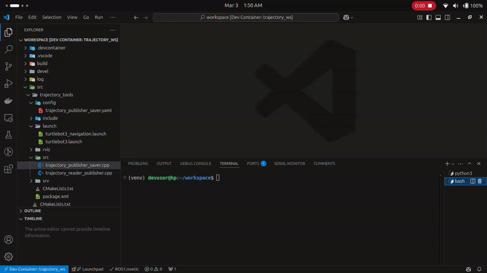

# Trajectory Visualization and Storage for AMR Navigation


## Problem Statement

In a manufacturing facility, an AMR moves materials between production stations. It uses ROS for navigation, mapping, and path planning. As it moves along predefined paths, tracking its trajectory is vital for monitoring and analysis. Manual handling of trajectory data for each navigation session is cumbersome and error-prone. Additionally, setting up RViz manually for each navigation session is inefficient, especially in a busy production environment. This problem seeks ROS nodes to automate trajectory visualization in RViz and facilitate easy storage in various file formats.

## Overview

This ROS package enables the visualization and storage of Autonomous Mobile Robot (AMR) trajectories. It consists of two main nodes: the `Trajectory Publisher and Saver Node` and the `Trajectory Reader and Publisher Node`. These nodes are designed to automate the process of visualizing the robot's path in RViz and storing the trajectory data for future analysis.

## Functions

### 1) **Trajectory Publisher and Saver Node:**

**Functanality**

- Collects the robot's path as it moves.
- Publishes the trajectory data as a marker array for RViz visualization.
- Provides a ROS service to save the trajectory data to a file in formats like JSON, CSV(TODO), or YAML(TODO).
- Users can specify a time duration for saving only the trajectory data within that period.

**Key Classes and Methods:**

- **TrajectoryPubSaver**: Main class for the node.
   - **load_parameters**: Loads parameters from the parameter server.
   - **setup_subscriptions**: Sets up the odometry subscription.
   - **setup_publishers**: Sets up the marker array publisher.
   - **setup_services**: Sets up the service to save the trajectory.
   - **odom_callback**: Callback function for odometry data.
   - **publish_trajectory**: Publishes the trajectory as a marker array.
   - **save_trajectory_callback**: Callback function to save the trajectory to a file.

**Parameters:**

- **odom_topic**
   - Type: `string`
   - Default Value: `/odom`
   - Description: The topic name for odometry data.
   
- **marker_topic**
   - Type: `string`
   - Default Value: `/trajectory_marker`
   - Description: The topic name for marker data.
   
- **trajectory_folder_path**
   - Type: `string`
   - Default Value: `/tmp/`
   - Description: The path to save trajectory files.

---

### 2) **Trajectory Reader and Publisher Node:**
- Reads the saved trajectory file.
- Transforms the trajectory data to the odom frame.
- Publishes the transformed trajectory data for visualization.

**Key Classes and Methods:**

- **TrajectoryReaderPublisher**: Main class for the node.
   - **load_parameters**: Loads parameters from the parameter server.
   - **setup_publishers**: Sets up the marker array publisher.
   - **read_trajectory_from_file**: Reads the trajectory from a JSON file.
   - **publish_trajectory**: Publishes the trajectory as a marker array.

**Parameters:**

- **odom_topic**
   - Type: `string`
   - Default Value: `/odom`
   - Description: The topic name for odometry data.
   
- **marker_topic**
   - Type: `string`
   - Default Value: `/trajectory_marker`
   - Description: The topic name for marker data.
   
- **trajectory_folder_path**
   - Type: `string`
   - Default Value: `/tmp/`
   - Description: The path to save trajectory files.

- **trajectory_file_name**
   - Type: `string`
   - Default Value: `trajectory`
   - Description: The name of the trajectory file.

---

### 3) Service Message

**Request**

- The service accepts a requests with:
   - `string filename`: The name of the file to save.
   - `double duration`: The duration of the trajectory to save.
   
**Response**

- It responds with:
   - `bool success`: Indicates if the saving was successful.
   - `string message`: A message indicating the result of the operation.

## Pseudocode

### 1. Trajectory Publisher and Saver Node

1. **Initialize Node**
   - Create a ROS2 node named `trajectory_publisher_saver`.
   - Load parameters from the parameter server:
     - `odom_topic`: Topic name for odometry data.
     - `marker_topic`: Topic name for marker data.
     - `trajectory_folder_path`: Path to save trajectory files.

2. **Setup Subscriptions**
   - Subscribe to the odometry topic (`odom_topic`).
   - Define a callback function (`odom_callback`) to handle incoming odometry messages.

3. **Setup Publishers**
   - Create a publisher for marker arrays (`marker_pub_`).

4. **Setup Services**
   - Create a service (`save_trajectory_srv_`) to save the trajectory data to a file.
   - Define a callback function (`save_trajectory_callback`) to handle service requests.

5. **Odometry Callback (`odom_callback`)**
   - Extract the position from the odometry message.
   - Create a `TrajectoryPoint` with the extracted position and current timestamp.
   - Add the `TrajectoryPoint` to the trajectory vector (`trajectory_`).
   - Call the `publish_trajectory` function to publish the trajectory.

6. **Publish Trajectory (`publish_trajectory`)**
   - Create a `MarkerArray` and a `Marker`.
   - Set the marker properties (frame ID, type, scale, color).
   - Add the trajectory points to the marker.
   - Publish the marker array.

7. **Save Trajectory Callback (`save_trajectory_callback`)**
   - Extract the filename and duration from the service request.
   - Filter the trajectory points based on the specified duration.
   - If no points are found within the duration, return an error response.
   - Save the filtered trajectory points to a JSON file.
   - Return a success response.

---

### 2. Trajectory Reader and Publisher Node

1. **Initialize Node**
   - Create a ROS2 node named `trajectory_reader_publisher`.
   - Load parameters from the parameter server:
     - `odom_topic`: Topic name for odometry data.
     - `marker_topic`: Topic name for marker data.
     - `trajectory_folder_path`: Path to save trajectory files.
     - `trajectory_file_name`: Name of the trajectory file.

2. **Setup Publishers**
   - Create a publisher for marker arrays (`marker_pub_`).

3. **Read Trajectory from File (`read_trajectory_from_file`)**
   - Construct the file path using `trajectory_folder_path` and `trajectory_file_name`.
   - Open the trajectory file.
   - If the file cannot be opened, log an error and return.
   - Read the JSON data from the file.
   - For each point in the JSON data:
     - Create a `TrajectoryPoint` with the position and timestamp.
     - Add the `TrajectoryPoint` to the trajectory vector (`trajectory_`).
   - Log the number of loaded trajectory points.
   - Call the `publish_trajectory` function to publish the trajectory.

4. **Publish Trajectory (`publish_trajectory`)**
   - If the trajectory vector is empty, log a warning and return.
   - Create a `MarkerArray` and a `Marker`.
   - Set the marker properties (frame ID, type, scale, color).
   - For each point in the trajectory vector:
     - Add the point to the marker.
     - Set the marker ID.
     - Add the marker to the marker array.
     - Publish the marker array.
     - Log the published point's timestamp.
     - If there are more points, calculate the delay to the next point and sleep for that duration.
   - Log the completion of trajectory publishing.


## Installation

1) Clone the repository into your ROS workspace:

```
mkdir -p workspace/src
cd workspace
git clone  https://github.com/manojm-dev/Trajectory-Tools.git src/trajectory_tools
```


2) Build the package:

```
colcon build 
```

3) Source the workspace:

```
source install/setup.bash
```

## Usage

### 1. Launching the turtlebot simulation

This will start the gazebo simulation environment with turtlebot3 and rviz2.

**Start the Simulation**
```
ros2 launch trajectory_tools turtlebot.launch.py
```

### 2. Running the Trajectory Publisher and Saver Node

This node listens to the odometry topic, tracks the robot’s trajectory, and publishes it as a MarkerArray for visualization in RViz. It also provides a service to save trajectory data.

**i) Edit the config file**

This [trajectory_publisher_saver.yaml](`config/trajectory_publisher_saver.yaml`) file configures the trajectory_publisher_saver node.

**Change this as per your wish**

> [!WARNING]
>`odom_topic` in this config should not be changed in this example as turtlebot3 uses `/odom` topic only. <br>
> if you change the `marker_topic` please don't forget to change it in the rviz2.

```
trajectory_publisher_saver:
  ros__parameters:
    odom_topic: "/odom"
    marker_topic: "/trajectory_marker"
    trajectory_folder_path: "/tmp/"
```

**ii) Start the Node**

To starts the `trajectory_publisher_saver` node with the parameters from the YAML file we use a launch file here.

> [!NOTE]
> If you open another terminal please do source the workspace before proceeding to execute the cmd.


```
ros2 launch trajectory_tools trajectory_publisher_saver.launch.py
```

**iii) Move the robot**

To visulize the marker we need to move the robot. To move the robot first we should switch to rviz window to localize the robot using the `2D Pose Estimate` arrow and give can able to command the robot to any particular position using `Nav2 Goal` arrow.

**iv) Call the Service**

To save the last 10 seconds of trajectory data to a file named `test.json` inside `/tmp` directory(default param)run this in another terminal:

> [!NOTE]
> If you open another terminal please do source the workspace before proceeding to run it in the terminal

```
ros2 service call /save_trajectory trajectory_tools/srv/SaveTrajectory "{filename: 'test', duration: 10.0}"
```



### 3. Running the Trajectory Reader and Publisher Node

This node reads a saved trajectory file, applies necessary transformations, and republishes it for visualization in RViz.

**i) Edit the config file**

This yaml config file plays trajectory file `test.json` inside `/tmp` directory(default save location)

> [!WARNING]
>`odom_topic` in this config should not be changed in this example as turtlebot3 uses `/odom` topic only. <br>
> if you change the `marker_topic` please don't forget to change it in the rviz2.

```
trajectory_reader_publisher:
  ros__parameters:
    odom_topic: "/odom"
    marker_topic: "/trajectory_marker"
    trajectory_folder_path: "/tmp/"
    trajectory_file_name: "test"
```

**ii) Start the Node**

To starts the `trajectory_reader_publisher` node with the parameters from the YAML file we use a launch file here.

> [!NOTE]
> If you open another terminal please do source the workspace before proceeding to run it in the terminal

```
ros2 launch trajectory_tools trajectory_reader_publisher.launch.py
```

**iii) Viewing the data**

In order to view the visualized the trajectory data in `MarkerArrays` we have to switch to the rviz2 window.


